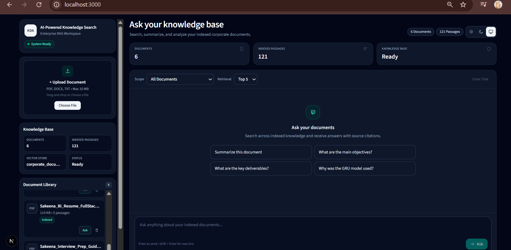
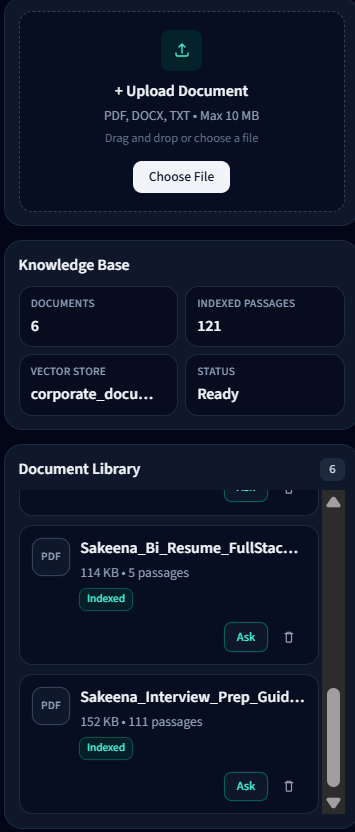
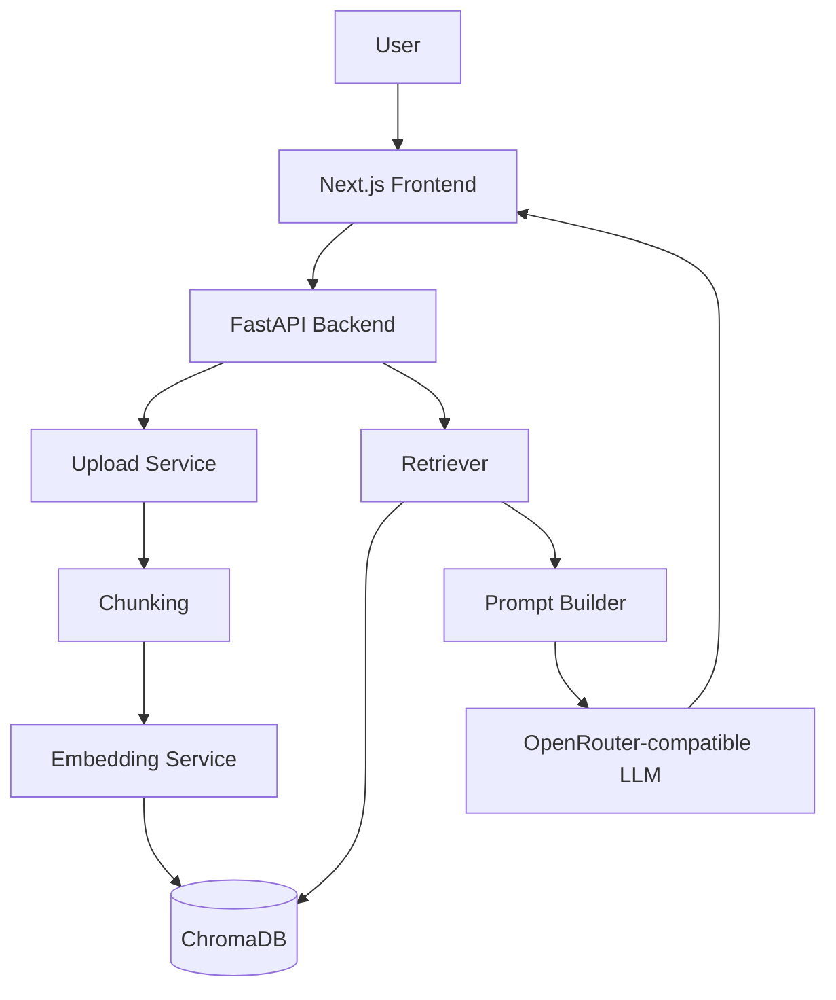

# AI-Powered Knowledge Search

**AI-powered Retrieval-Augmented Generation (RAG) system for querying AI-Powered Knowledge Search documents.**

Turn AI-Powered Knowledge Search documents into reliable, source-grounded AI answers.

<p align="center">
  <a href="#features">Features</a> •
  <a href="#architecture">Architecture</a> •
  <a href="#installation">Installation</a> •
  <a href="#api">API</a> •
  <a href="#screenshots">Screenshots</a> •
  <a href="#roadmap">Roadmap</a>
</p>

<p align="center">
  
  
  
  
  
</p>

<p align="center">
  
  
  
  
</p>

AI-Powered Knowledge Search helps teams turn internal files into searchable knowledge. Upload PDF, DOCX, or TXT documents, process them into embeddings, store them in ChromaDB, and ask natural-language questions through a modern Next.js interface. Answers are grounded in retrieved context and returned with explicit source citations.

---

## Table of Contents

- [Overview](#overview)
- [Features](#features)
- [Demo](#demo)
- [Screenshots](#screenshots)
- [Architecture](#architecture)
- [Tech Stack](#tech-stack)
- [Project Structure](#project-structure)
- [Requirements](#requirements)
- [Installation](#installation)
- [API](#api)
- [How It Works](#how-it-works)
- [Example](#example)
- [Performance](#performance)
- [Security](#security)
- [Roadmap](#roadmap)
- [Contributing](#contributing)
- [License](#license)
- [Author](#author)

---

## Overview

Large language models are useful for natural-language interaction, but they can produce unsupported claims when they lack access to private company knowledge. Retrieval-Augmented Generation (RAG) addresses this by first searching your documents, then asking the model to answer from that retrieved context.

This design helps reduce unsupported answers because generation is constrained to evidence found in uploaded files. Source citations make every response easier to verify: users can inspect which document chunk supported a claim, which is important for policies, procedures, and technical reports.

AI-Powered Knowledge Search brings this workflow into a full-stack product: document ingestion, embedding, vector search, grounded generation, and a clean chat UI.

---

## Features

### Document Processing

-  Upload PDF / DOCX / TXT
-  Automatic Text Extraction
-  Smart Chunking

### AI Retrieval

-  Sentence Transformer Embeddings
-  ChromaDB Vector Database
-  Semantic Search
-  Retrieval-Augmented Generation
-  OpenRouter-compatible LLM Answers
-  Source Citation

### User Experience

-  Modern Chat Interface
-  Responsive Design

---


### Dashboard


<p align="center">
  
</p>


The main workspace shows document status, collection statistics, and the chat surface in a two-panel layout.

### Upload Documents


<p align="center">
  
</p>


Upload PDF, DOCX, or TXT files. The backend extracts text, chunks content, generates embeddings, and indexes vectors automatically.

---

## Architecture

```text
                 User
                   │
                   ▼
         Next.js Frontend
                   │
                   ▼
          FastAPI Backend
                   │
        ┌──────────┴──────────┐
        ▼                     ▼
 Retriever              Upload Service
        │                     │
        ▼                     ▼
 Prompt Builder          Chunking
        │                     │
        ▼                     ▼
 OpenRouter-compatible    Embedding Service
 LLM
        │                     │
        └──────────┬──────────┘
                   ▼
                ChromaDB
```



---

## Tech Stack

| Layer | Technology | Purpose |
| --- | --- | --- |
| Backend | Python | Runtime for API services and the document pipeline |
| Backend | FastAPI | REST endpoints for upload, list, stats, search, and ask |
| Backend | Pydantic / Pydantic Settings | Request validation and environment configuration |
| Backend | Uvicorn | ASGI server for local development |
| AI / Retrieval | Sentence Transformers | Multilingual dense embeddings |
| AI / Retrieval | LangChain Text Splitters | Recursive chunking with overlap |
| AI / Retrieval | ChromaDB | Persistent local vector storage and similarity search |
| AI / Retrieval | OpenAI SDK | OpenRouter-compatible chat completions |
| Frontend | Next.js | App Router UI for documents and chat |
| Frontend | TypeScript | Typed API client and component contracts |
| Frontend | Tailwind CSS | Responsive AI-Powered Knowledge Search interface |
| Tooling | Pytest | Backend unit and API tests |
| Tooling | ESLint | Frontend linting |

---

## Project Structure

```text
AI-Powered Knowledge Search-document-assistant/
├── backend/
│   ├── app/
│   │   ├── api/
│   │   ├── core/
│   │   ├── models/
│   │   ├── schemas/
│   │   ├── services/
│   │   └── utils/
│   ├── data/
│   ├── tests/
│   ├── .env.example
│   └── requirements.txt
├── frontend/
│   ├── src/
│   │   ├── app/
│   │   ├── components/
│   │   ├── lib/
│   │   └── types/
│   ├── .env.example
│   └── package.json
├── docs/
│   └── architecture.md
├── scripts/
├── images/
├── .gitignore
├── docker-compose.yml
└── README.md
```

| Path | Description |
| --- | --- |
| `backend/` | FastAPI application, settings, schemas, and RAG services |
| `backend/app/api/` | HTTP routers for documents and chat |
| `backend/app/services/` | Loader, splitter, embeddings, vector store, retriever, and RAG |
| `backend/tests/` | Pytest coverage for RAG and chat flows |
| `frontend/` | Next.js App Router client for upload, list, stats, and chat |
| `frontend/src/components/` | UI building blocks such as Sidebar, ChatPanel, and SourceCard |
| `docs/` | Project documentation such as architecture notes |
| `scripts/` | Reserved for utility and maintenance helpers |
| `images/` | Reserved for README screenshots and demo assets |

---

## Requirements

Before installation, make sure you have:

- Python 3.12+
- Node.js 20+
- npm
- Git
- OpenRouter API Key

---

## Installation

### 1) Clone the repository

```bash
git clone https://github.com/sakeenabi03/AI-Powered-Knowledge-Search.git
cd AI-powered-Knowledge-Search
```

### 2) Backend setup

```bash
cd backend
python -m venv venv

# Windows (PowerShell)
.\venv\Scripts\Activate.ps1

# macOS / Linux
source venv/bin/activate

pip install -r requirements.txt
copy .env.example .env   # Windows
# cp .env.example .env   # macOS / Linux
```

Start the API:

```bash
uvicorn app.main:app --reload --host 0.0.0.0 --port 8000
```

API docs: [http://localhost:8000/docs](http://localhost:8000/docs)

### 3) Frontend setup

```bash
cd frontend
npm install
npm run dev
```

App: [http://localhost:3000](http://localhost:3000)

### 4) OpenRouter configuration

Create `backend/.env` from the example file and set your key:

```env
LLM_PROVIDER=openrouter
LLM_MODEL=openai/gpt-4o-mini
LLM_BASE_URL=https://openrouter.ai/api/v1
LLM_API_KEY=your_openrouter_api_key_here
LLM_TEMPERATURE=0.2
LLM_MAX_TOKENS=700
RAG_TOP_K=5
MIN_SIMILARITY_SCORE=0.25
```

Create `frontend/.env.local` for the Next.js client:

```env
NEXT_PUBLIC_API_BASE_URL=http://localhost:8000
```

> Never commit real API keys. Keep `backend/.env` and `frontend/.env.local` out of version control.

---

## API

| Method | Endpoint | Request | Response | Purpose |
| --- | --- | --- | --- | --- |
| `POST` | `/api/chat/ask` | JSON (`query`, optional `top_k`, optional `filename`) | `ChatResponse` with answer, sources, model | Ask grounded questions with RAG |
| `POST` | `/api/chat/search` | JSON (`query`, optional `top_k`, optional `filename`) | Ranked chunk hits with similarity scores | Run semantic search without LLM generation |
| `POST` | `/api/documents/upload` | `multipart/form-data` file upload | Upload metadata + indexing stats | Upload and index a document |
| `GET` | `/api/documents/list` | None | Array of document items | List uploaded documents |
| `GET` | `/api/documents/stats` | None | Totals and collection name | Inspect collection and document statistics |
| `DELETE` | `/api/documents/{filename}` | Path parameter | Deletion confirmation + deleted vector count | Delete a document and its vectors |

Interactive OpenAPI documentation is available at `/docs` while the backend is running.

---

## How It Works

```text
1. Upload document
          ↓
2. Chunking
          ↓
3. Embedding
          ↓
4. ChromaDB
          ↓
5. Semantic Retrieval
          ↓
6. Prompt Builder
          ↓
7. OpenRouter-compatible LLM Answer
          ↓
8. Source Citation
```

1. **Upload document** — Accept PDF, DOCX, or TXT files through the API or UI and store them safely under the uploads directory.
2. **Chunking** — Split extracted text into overlapping retrieval-ready segments using recursive character splitting.
3. **Embedding** — Encode chunks with a multilingual Sentence Transformers model into dense vectors.
4. **ChromaDB** — Persist vectors and metadata such as filename, chunk index, and chunk ID in a local collection.
5. **Semantic Retrieval** — Embed the user query and rank the most relevant chunks by vector similarity.
6. **Prompt Builder** — Assemble system and user messages from retrieved context with grounding rules.
7. **OpenRouter-compatible LLM Answer** — Generate a natural-language response through an OpenRouter-compatible chat model.
8. **Source Citation** — Return the answer with numbered references so users can verify supporting excerpts.

---

## Example

**Question**

```text
Why was the GRU model selected?
```

**Answer**

```text
The GRU model was selected to capture long-term dependencies more efficiently
while keeping the architecture simpler than LSTM-based alternatives.
[Source 1]
```

**Sources**

| Source | File | Excerpt |
| --- | --- | --- |
| Source 1 | `One-Month Machine Learning Plan_ca5beb41.docx` | GRU was preferred for long-range dependencies and reduced training complexity. |
| Source 2 | `One-Month Machine Learning Plan_ca5beb41.docx` | Compared with LSTM, GRU offered a simpler recurrent structure for the planned experiments. |

> Example responses may vary depending on the uploaded documents and configured LLM.

---

## Performance

The stack is designed for practical local RAG workflows:

- **Sentence Transformers** generate multilingual embeddings suitable for AI-Powered Knowledge Search documents.
- **ChromaDB** provides persistent local vector storage without a managed database dependency.
- **Semantic Retrieval** ranks passages by meaning rather than exact keyword matches.
- **FastAPI** keeps upload, indexing, search, and ask endpoints lightweight and async-friendly.
- **Source Grounding** filters low-similarity chunks before LLM generation to keep answers tied to evidence.

No benchmark numbers are claimed here. Measure latency on your own hardware and document set.

---

## Security

- Secrets are loaded from environment variables via `.env` files.
- API keys are never hardcoded in source files or returned in API responses.
- Example environment files are provided; real credentials stay local and gitignored.
- Upload and delete paths are validated to reduce path traversal risk.
- Request payloads are validated with Pydantic models before processing.
- Prompt construction treats document content as data, not executable instructions.

---
